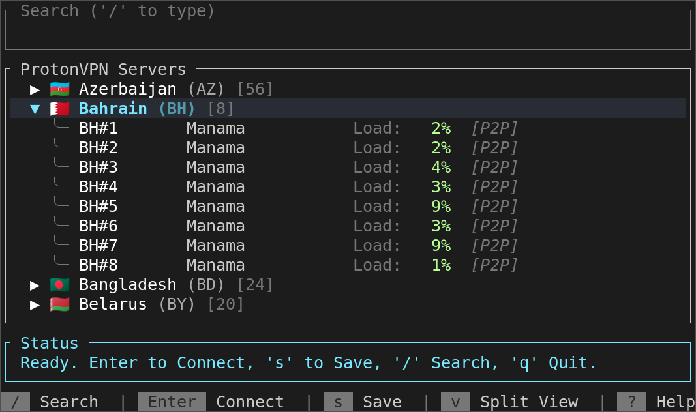

# Proton TUI


A modern, feature-rich Terminal User Interface (TUI) for ProtonVPN, written in Rust.

> **⚠️ DISCLAIMER**
>
> This project is **NOT** affiliated with, endorsed by, or connected to Proton AG or ProtonVPN in any way. It is an unofficial, community-driven tool.
>
> This software is provided "as is", without warranty of any kind. The authors and contributors assume **ZERO LIABILITY** for any damages, security issues, or data loss arising from the use of this software. Use it at your own risk.
>
> This codebase was almost entirely generated by AI coding agents with virtually no manual code editing.

## 🖥️ Interface


## ✨ Features

*   **Full TUI Experience**: Navigate servers and countries using your keyboard.
*   **ProtonVPN Integration**: Authenticates directly with ProtonVPN using your credentials (supports 2FA/SRP).
*   **WireGuard Support**: Automatically manages WireGuard keys and configurations.
*   **Efficient Search**: Quickly find servers by name, country, or city.
*   **Dual Views**: Switch between a nested Tree View or a Split View (Country/Server panes).
*   **Live Status**: Real-time connection status and uptime monitoring.

## 🐧 Prerequisites

This tool currently works **only on Linux**. It relies on the system's `wireguard-tools` to manage connections.

1.  **Rust**: You need the Rust toolchain installed (if building from source).
2.  **WireGuard**: Ensure `wireguard-tools` is installed on your system.
    ```bash
    # Debian/Ubuntu
    sudo apt install wireguard-tools

    # Arch Linux
    sudo pacman -S wireguard-tools
    ```
3.  **Root Privileges**: The tool uses `sudo wg-quick` to establish network interfaces. You will be prompted for your sudo password when connecting.

## 🚀 Installation

### Download Binary (Recommended)

You can download the latest prebuilt binary from the [Releases](https://github.com/cdump/proton-tui/releases) page.

```bash
# 1. Download the binary
curl -L -o proton-tui https://github.com/cdump/proton-tui/releases/latest/download/proton-tui-linux-x86_64

# 2. Make it executable
chmod +x proton-tui

# 3. Run it
./proton-tui
```

### From Source

```bash
# Clone the repository
git clone https://github.com/cdump/proton-tui.git
cd proton-tui

# Build and run
cargo run --release
```

Or install it globally:

```bash
cargo install --path .
```

## 📖 Usage

Run the application:

```bash
proton-tui
```

### Keybindings

| Key | Action |
| --- | --- |
| **Navigation** | |
| `↑` / `k` | Move selection up |
| `↓` / `j` | Move selection down |
| `Space` | Toggle country expansion (Tree View) |
| `Tab` | Switch between panes (Split View) |
| `v` | Toggle between Tree View and Split View |
| **Connection** | |
| `Enter` | Connect to selected server |
| `d` | Disconnect (from status bar/popup) |
| **General** | |
| `/` | Search servers |
| `s` | Save WireGuard config locally |
| `?` | Show Help Popup |
| `Esc` | Cancel search / close popups |
| `q` | Quit application |
| `Ctrl+C` | Force quit |

## ⚙️ Configuration

Authentication tokens are cached locally for subsequent sessions:

```
~/.config/proton-tui/tokens.json
```

To logout or clear cached credentials, simply delete this file:

```bash
rm ~/.config/proton-tui/tokens.json
```

## 🛠️ Technical Details

*   **Config Storage**: Temporary WireGuard configurations are written to `$XDG_RUNTIME_DIR/proton-tui/proton-tui0.conf` (falling back to `/tmp/proton-tui/proton-tui0.conf`) with restricted permissions (`600`). Saved configs go to `$XDG_CONFIG_HOME/proton-tui/proton-tui0.conf`.
*   **Authentication**: Uses Proton's SRP (Secure Remote Password) protocol for login. Tokens are cached locally for subsequent sessions.
*   **Networking**: Spawns `sudo wg-quick up/down` processes to manage the `proton-tui0` network interface.
*   **DNS**: The application does **not** modify your DNS settings. It relies on your system's existing DNS configuration.

## 📄 License

This project is licensed under the [MIT License](LICENSE).
